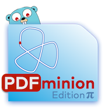

# 

Helper (_minion_) for some mundane tasks with PDF documents, among others:

* add page numbers
* add header and/or footer text
* merge (concatenate, combine multiple PDF files into a single file)

>  minion: a servile dependent, follower, or underling.  
> "He's one of the boss's minions." 
> From: [Merriam-Webster Dictionary](https://www.merriam-webster.com/dictionary/minion)

## Status

### Experimental Badges

### Explanation

The low test coverage stems from the fact that a lot of functionality can only be realistically tested by manually inspecting the generated PDF files.

## Features

When creating multiple PDF documents, you often need to add page numbers, headers, footers, or combine multiple PDF files into a single file.
PDFminion can do that for you - from a terminal and the command line, on macOS, Linux and Windows platforms.

## Installation and usage

See the [comprehensive website](https://pdfminion.arc42.org) for details on installation and usage.

## Credits

Please see the [credits section](https://pdfminion.arc42.org/#credits) on our website for a list of contributors and third-party libraries used in here.